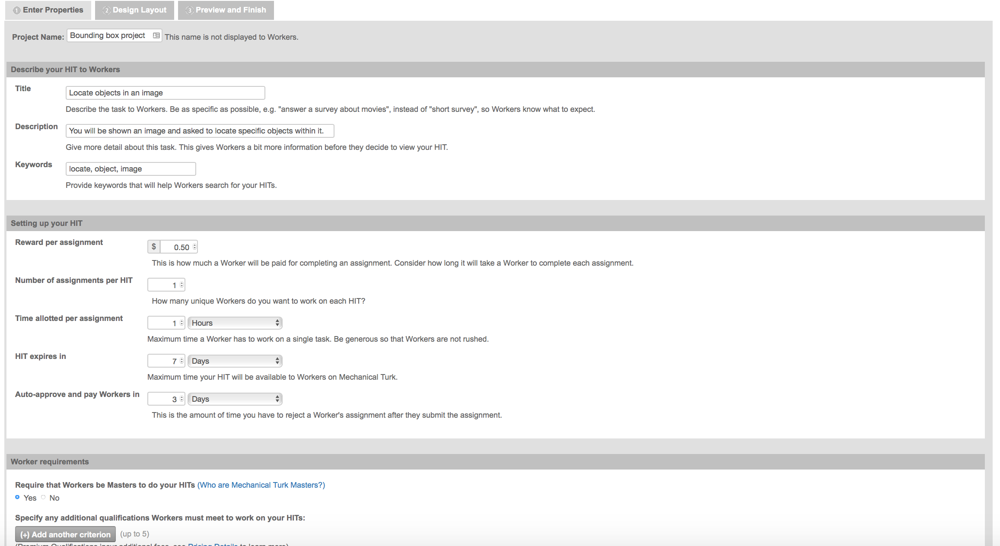
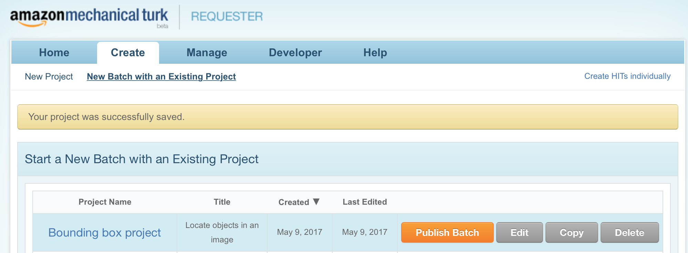
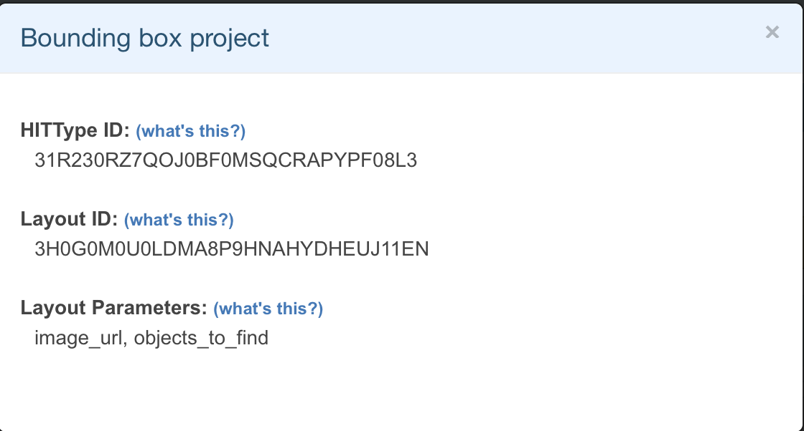
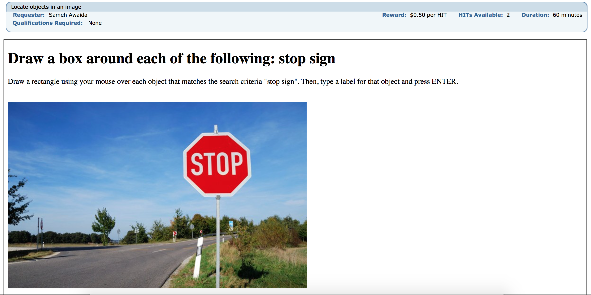
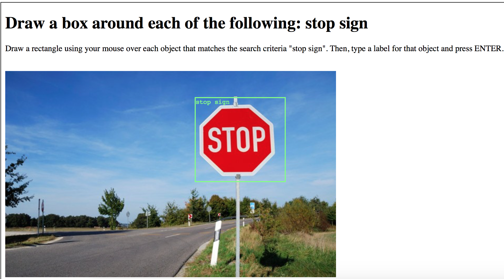

# Crowdsourcing Image Annotations - Part 3

## Annotating images with bounding boxes using Amazon Mechanical Turk

In this tutorial, we are going to use Boto3, the AWS SDK for Python Version 3, to access the Amazon Mechanical Turk API. After installing the Boto SDK, we are going to use Boto3 for croudsourcing image annotations.

This third part shows how Requesters can use MTurk to locate objects in images. We will create a Human Intelligence Task (HIT) that will ask Workers to draw a bounding box around specific objects. Once the HIT is submitted, the Requester will receive a set of coordinates corresponding to the points the Worker has labeled. This information will allow the Requester to have Workers locate objects in images, so that they can then help train machines to perform the same operation.

We will build upon the Python tutorials that we have used so far. If you are new to this, please begin by following the steps in [Part 1](crowdsourcing_image_annotation_part1.md) and [Part 2](crowdsourcing_image_annotation_part2.md) of the tutorial. We will be building on concepts from both these tutorials today.

I have developed these tutorials by migrating previous Amazon tutorials for Boto2 and changing the code and steps as needed, specifically:

- [Tutorial: Getting started with MTurk and Python using Boto](https://blog.mturk.com/tutorial-getting-started-with-mturk-and-python-using-boto-452fb0243a30#.eggez6xwf)

- [Tutorial: Using the MTurk Requester Website together with Python and Boto](https://blog.mturk.com/tutorial-using-the-mturk-requester-website-together-with-python-and-boto-4a7ef0264b7e#.7uz9w4hov)

- [Tutorial: Annotating images with bounding boxes using Amazon Mechanical Turk](https://blog.mturk.com/tutorial-annotating-images-with-bounding-boxes-using-amazon-mechanical-turk-42ab71e5068a#.z0clf9aln)

- [Tutorial: Retrieving bounding box image annotations from MTurk](https://blog.mturk.com/tutorial-retrieving-bounding-box-image-annotations-from-mturk-253b86cb7502#.obytdqw01)

- [Tutorial: Measuring the accuracy of bounding box image annotations from MTurk](https://blog.mturk.com/tutorial-measuring-the-accuracy-of-bounding-box-image-annotations-from-mturk-ad3dfcdf8aa0#.m2fm7ad1q)

- [MTurk Code Samples Python](https://github.com/awslabs/mturk-code-samples/tree/master/Python)

## Creating your Bounding Box HIT template

We will begin by preparing your HIT template for Workers. In today’s tutorial, we will show how you can use the open source work from Kota Yamaguchi of Tohoku University in Japan. Kota has created a bounding box control, and has included an example demonstrate how this can work with MTurk. You can access Kota’s code repository here: [Kota's Code Repository](https://github.com/kyamagu/bbox-annotator).

To begin, sign in to your Sandbox Requester account https://requestersandbox.mturk.com/. Once signed in, click Create, then New Project, select the “Other” Project Template, and click Create Project. Here are the values we used in ours:



Once you’ve entered your values on this page, click “Design Layout.” This will take you to the page where you’ll define the way the HIT will look to Workers.
Click the “Source” button in the top right corner of the editor. This will bring you to a view where you can edit the raw HTML source of the HIT template. In this view, paste the following code in the editor. This is the code from Kota’s bbox-annotator tool:

```xml
<div style="display:none;">&nbsp;</div>
<link href="https://ajax.googleapis.com/ajax/libs/jqueryui/1.10.3/themes/smoothness/jquery-ui.css" rel="stylesheet" /><script src="https://ajax.googleapis.com/ajax/libs/jquery/1.9.1/jquery.min.js"></script><script src="https://ajax.googleapis.com/ajax/libs/jqueryui/1.10.3/jquery-ui.js"></script>
<div style="display:inline-block;vertical-align:top;">
<h1>Draw a box around each of the following: ${objects_to_find}</h1>
<p>Draw a rectangle using your mouse over each object that matches the search criteria &quot;${objects_to_find}&quot;. Then, type a label for that object and press ENTER.</p>
<div id="bbox_annotator" style="display:inline-block">&nbsp;</div><p/><p/>
<p id="button_paragraph"><input id="annotation_data" name="annotation_data" type="hidden" /> <input id="reset_button" type="reset" /></p>
</div>
<script type="text/javascript">
(function() {
  var BBoxSelector;
BBoxSelector = (function() {
function BBoxSelector(image_frame, options) {
      if (options == null) {
        options = {};
      }
      options.input_method || (options.input_method = "text");
      this.image_frame = image_frame;
      this.border_width = options.border_width || 2;
      this.selector = $('<div class="bbox_selector"></div>');
      this.selector.css({
        "border": this.border_width + "px dotted rgb(127,255,127)",
        "position": "absolute"
      });
      this.image_frame.append(this.selector);
      this.selector.css({
        "border-width": this.border_width
      });
      this.selector.hide();
      this.create_label_box(options);
    }
BBoxSelector.prototype.create_label_box = function(options) {
      var label, _i, _len, _ref;
      options.labels || (options.labels = ["object"]);
      this.label_box = $('<div class="label_box"></div>');
      this.label_box.css({
        "position": "absolute"
      });
      this.image_frame.append(this.label_box);
      switch (options.input_method) {
        case 'select':
          if (typeof options.labels === "string") {
            options.labels = [options.labels];
          }
          this.label_input = $('<select class="label_input" name="label"></select>');
          this.label_box.append(this.label_input);
          this.label_input.append($('<option value>choose an item</option>'));
          _ref = options.labels;
          for (_i = 0, _len = _ref.length; _i < _len; _i++) {
            label = _ref[_i];
            this.label_input.append('<option value="' + label + '">' + label + '</option>');
          }
          this.label_input.change(function(e) {
            return this.blur();
          });
          break;
        case 'text':
          if (typeof options.labels === "string") {
            options.labels = [options.labels];
          }
          this.label_input = $('<input class="label_input" name="label" ' + 'type="text" value>');
          this.label_box.append(this.label_input);
          this.label_input.autocomplete({
            source: options.labels || [''],
            autoFocus: true
          });
          break;
        case 'fixed':
          if ($.isArray(options.labels)) {
            options.labels = options.labels[0];
          }
          this.label_input = $('<input class="label_input" name="label" type="text">');
          this.label_box.append(this.label_input);
          this.label_input.val(options.labels);
          break;
        default:
          throw 'Invalid label_input parameter: ' + options.input_method;
      }
      return this.label_box.hide();
    };
BBoxSelector.prototype.crop = function(pageX, pageY) {
      var point;
      return point = {
        x: Math.min(Math.max(Math.round(pageX - this.image_frame.offset().left), 0), Math.round(this.image_frame.width() - 1)),
        y: Math.min(Math.max(Math.round(pageY - this.image_frame.offset().top), 0), Math.round(this.image_frame.height() - 1))
      };
    };
BBoxSelector.prototype.start = function(pageX, pageY) {
      this.pointer = this.crop(pageX, pageY);
      this.offset = this.pointer;
      this.refresh();
      this.selector.show();
      $('body').css('cursor', 'crosshair');
      return document.onselectstart = function() {
        return false;
      };
    };
BBoxSelector.prototype.update_rectangle = function(pageX, pageY) {
      this.pointer = this.crop(pageX, pageY);
      return this.refresh();
    };
BBoxSelector.prototype.input_label = function(options) {
      $('body').css('cursor', 'default');
      document.onselectstart = function() {
        return true;
      };
      this.label_box.show();
      return this.label_input.focus();
    };
BBoxSelector.prototype.finish = function(options) {
      var data;
      this.label_box.hide();
      this.selector.hide();
      data = this.rectangle();
      data.label = $.trim(this.label_input.val().toLowerCase());
      if (options.input_method !== 'fixed') {
        this.label_input.val('');
      }
      return data;
    };
BBoxSelector.prototype.rectangle = function() {
      var rect, x1, x2, y1, y2;
      x1 = Math.min(this.offset.x, this.pointer.x);
      y1 = Math.min(this.offset.y, this.pointer.y);
      x2 = Math.max(this.offset.x, this.pointer.x);
      y2 = Math.max(this.offset.y, this.pointer.y);
      return rect = {
        left: x1,
        top: y1,
        width: x2 - x1 + 1,
        height: y2 - y1 + 1
      };
    };
BBoxSelector.prototype.refresh = function() {
      var rect;
      rect = this.rectangle();
      this.selector.css({
        left: (rect.left - this.border_width) + 'px',
        top: (rect.top - this.border_width) + 'px',
        width: rect.width + 'px',
        height: rect.height + 'px'
      });
      return this.label_box.css({
        left: (rect.left - this.border_width) + 'px',
        top: (rect.top + rect.height + this.border_width) + 'px'
      });
    };
BBoxSelector.prototype.get_input_element = function() {
      return this.label_input;
    };
return BBoxSelector;
})();
this.BBoxAnnotator = (function() {
function BBoxAnnotator(options) {
      var annotator, image_element;
      annotator = this;
      this.annotator_element = $(options.id || "#bbox_annotator");
      this.border_width = options.border_width || 2;
      this.show_label = options.show_label || (options.input_method !== "fixed");
      this.image_frame = $('<div class="image_frame"></div>');
      this.annotator_element.append(this.image_frame);
      image_element = new Image();
      image_element.src = options.url;
      image_element.onload = function() {
        options.width || (options.width = image_element.width);
        options.height || (options.height = image_element.height);
        annotator.annotator_element.css({
          "width": (options.width + annotator.border_width * 2) + 'px',
          "height": (options.height + annotator.border_width * 2) + 'px',
          "cursor": "crosshair"
        });
        annotator.image_frame.css({
          "background-image": "url('" + image_element.src + "')",
          "width": options.width + "px",
          "height": options.height + "px",
          "position": "relative"
        });
        annotator.selector = new BBoxSelector(annotator.image_frame, options);
        return annotator.initialize_events(annotator.selector, options);
      };
      image_element.onerror = function() {
        return annotator.annotator_element.text("Invalid image URL: " + options.url);
      };
      this.entries = [];
      this.onchange = options.onchange;
    }
BBoxAnnotator.prototype.initialize_events = function(selector, options) {
      var annotator, status;
      status = 'free';
      this.hit_menuitem = false;
      annotator = this;
      this.annotator_element.mousedown(function(e) {
        if (!annotator.hit_menuitem) {
          switch (status) {
            case 'free':
            case 'input':
              if (status === 'input') {
                selector.get_input_element().blur();
              }
              if (e.which === 1) {
                selector.start(e.pageX, e.pageY);
                status = 'hold';
              }
          }
        }
        annotator.hit_menuitem = false;
        return true;
      });
      $(window).mousemove(function(e) {
        switch (status) {
          case 'hold':
            selector.update_rectangle(e.pageX, e.pageY);
        }
        return true;
      });
      $(window).mouseup(function(e) {
        switch (status) {
          case 'hold':
            selector.update_rectangle(e.pageX, e.pageY);
            selector.input_label(options);
            status = 'input';
            if (options.input_method === 'fixed') {
              selector.get_input_element().blur();
            }
        }
        return true;
      });
      selector.get_input_element().blur(function(e) {
        var data;
        switch (status) {
          case 'input':
            data = selector.finish(options);
            if (data.label) {
              annotator.add_entry(data);
              if (annotator.onchange) {
                annotator.onchange(annotator.entries);
              }
            }
            status = 'free';
        }
        return true;
      });
      selector.get_input_element().keypress(function(e) {
        switch (status) {
          case 'input':
            if (e.which === 13) {
              selector.get_input_element().blur();
            }
        }
        return e.which !== 13;
      });
      selector.get_input_element().mousedown(function(e) {
        return annotator.hit_menuitem = true;
      });
      selector.get_input_element().mousemove(function(e) {
        return annotator.hit_menuitem = true;
      });
      selector.get_input_element().mouseup(function(e) {
        return annotator.hit_menuitem = true;
      });
      return selector.get_input_element().parent().mousedown(function(e) {
        return annotator.hit_menuitem = true;
      });
    };
BBoxAnnotator.prototype.add_entry = function(entry) {
      var annotator, box_element, close_button, text_box;
      this.entries.push(entry);
      box_element = $('<div class="annotated_bounding_box"></div>');
      box_element.appendTo(this.image_frame).css({
        "border": this.border_width + "px solid rgb(127,255,127)",
        "position": "absolute",
        "top": (entry.top - this.border_width) + "px",
        "left": (entry.left - this.border_width) + "px",
        "width": entry.width + "px",
        "height": entry.height + "px",
        "color": "rgb(127,255,127)",
        "font-family": "monospace",
        "font-size": "small"
      });
      close_button = $('<div></div>').appendTo(box_element).css({
        "position": "absolute",
        "top": "-8px",
        "right": "-8px",
        "width": "16px",
        "height": "0",
        "padding": "16px 0 0 0",
        "overflow": "hidden",
        "color": "#fff",
        "background-color": "#030",
        "border": "2px solid #fff",
        "-moz-border-radius": "18px",
        "-webkit-border-radius": "18px",
        "border-radius": "18px",
        "cursor": "pointer",
        "-moz-user-select": "none",
        "-webkit-user-select": "none",
        "user-select": "none",
        "text-align": "center"
      });
      $("<div></div>").appendTo(close_button).html('×').css({
        "display": "block",
        "text-align": "center",
        "width": "16px",
        "position": "absolute",
        "top": "-2px",
        "left": "0",
        "font-size": "16px",
        "line-height": "16px",
        "font-family": '"Helvetica Neue", Consolas, Verdana, Tahoma, Calibri, ' + 'Helvetica, Menlo, "Droid Sans", sans-serif'
      });
      text_box = $('<div></div>').appendTo(box_element).css({
        "overflow": "hidden"
      });
      if (this.show_label) {
        text_box.text(entry.label);
      }
      annotator = this;
      box_element.hover((function(e) {
        return close_button.show();
      }), (function(e) {
        return close_button.hide();
      }));
      close_button.mousedown(function(e) {
        return annotator.hit_menuitem = true;
      });
      close_button.click(function(e) {
        var clicked_box, index;
        clicked_box = close_button.parent(".annotated_bounding_box");
        index = clicked_box.prevAll(".annotated_bounding_box").length;
        clicked_box.detach();
        annotator.entries.splice(index, 1);
        return annotator.onchange(annotator.entries);
      });
      return close_button.hide();
    };
BBoxAnnotator.prototype.clear_all = function(e) {
      $(".annotated_bounding_box").detach();
      this.entries.splice(0);
      return this.onchange(this.entries);
    };
return BBoxAnnotator;
})();
}).call(this);
// Main entry point. Use a placeholder for image urls.
$(document).ready(function() {
  var assignment_id = turkGetParam('assignmentId', "");
  // Initialize the bounding-box annotator.
  var annotator = new BBoxAnnotator({
    url: "${image_url}",
    input_method: 'text', // Can be one of ['text', 'select', 'fixed']
    labels: ["dress", "top", "skirt", "pants", "shoes"], // Label of the object.
    onchange: function(entries) {
      $("#annotation_data").val(JSON.stringify(entries));
      if (entries.length > 0 &&
          assignment_id != "" &&
          assignment_id != "ASSIGNMENT_ID_NOT_AVAILABLE") {
        $("#submitButton").removeAttr("disabled");
      }
      else {
        $("#submitButton").attr("disabled", "disabled");
      }
    }
  });
  // Initialize the reset button.
  $("#reset_button").click(function(e) {
    annotator.clear_all();
  });
  // Disable the submission at the beginning.
  $("#submitButton").attr("disabled", "disabled");
  $("#submitButton").detach().appendTo("#button_paragraph");
  if (assignment_id == "ASSIGNMENT_ID_NOT_AVAILABLE") {
    $("#submitButton").val("This is preview");
  }
  console.log(assignment_id);
});
</script>
```

There are two important parts of the code above to draw your attention to. Both are in bold. The first, is in the instructions section near the top. You will notice a section of code that looks like this:

<pre>
Draw a rectangle using your mouse over each object that matches the search criteria <b>${objects_to_find}</b>. Then, type a label for that object and press ENTER.</p>
</pre>

Here we are using the placeholder $objects_to_find to represent the instruction we will give Workers on what they should be looking for and drawing boxes around.
In another section of code above, you’ll see where we specify the image URL. It looks like this:

<pre> 
var annotator = new BBoxAnnotator({
url: " <b> ${image_url} </b>
input_method: 'text', // Can be one of ['text', 'select', 'fixed']
    labels: ["dress", "top", "skirt", "pants", "shoes"], // Label of the object.
</pre>

This code defines the BBoxAnnotator control which takes as parameter the url of the image. You’ll see that we provide the URL using another placeholder called **$image_url**. You’ll also see additional options available on the lines:

```html
input_method: 'text', // Can be one of ['text', 'select', 'fixed']
labels: ["dress", "top", "skirt", "pants", "shoes"],
```

You can learn more about these variables by checking out Kota’s demo of the control here: https://kyamagu.github.io/bbox-annotator/demo.html

Click “Source” again to return to the Layout view, then click Save. You have now created a new HIT template.

## Using your Bounding Box HIT Template

By clicking the “Create” tab, and selecting “New Batch with an Exiting Project” you should see the Bounding Box Template you created at the top of the list:



From here, you can click Publish Batch to immediately publish HITs with this template using the Requester Website. 

However, We’re going to take it a step further, and use Boto and Python to create these HITs with code.

Click the Project Name to see the identifiers needed for our code. You should see a page that looks like this:



Now, in your Python code, paste the following:


```python
import boto3

# Use the Amazon Mechanical Turk Sandbox to publish test Human Intelligence Tasks (HITs) without paying any money.
# Uncomment the below to connect to the live marketplace
host = 'https://mturk-requester-sandbox.us-east-1.amazonaws.com'
# Uncomment line below to connect to the live marketplace instead of the sandbox
# host = 'https://mturk-requester.us-east-1.amazonaws.com'


client = boto3.client('mturk', endpoint_url=host)

response = client.create_hit_with_hit_type(
    HITLayoutId="3H0G0M0U0LDMA8P9HNAHYDHEUJ11EN",
    HITTypeId="31R230RZ7QOJ0BF0MSQCRAPYPF08L3",
    HITLayoutParameters=[
        {
            'Name': 'image_url',
            'Value': 'http://turk.s3.amazonaws.com/stop_sign_picture.jpg'
        },
        {
            'Name': 'objects_to_find',
            'Value': 'stop sign'
        },
    ],
    LifetimeInSeconds=600,
)


# The response included several fields that will be helpful later
hit_type_id = response['HIT']['HITTypeId']
hit_id = response['HIT']['HITId']
print("Your HIT has been created. You can see it at this link:")
print("https://workersandbox.mturk.com/mturk/preview?groupId={}".format(hit_type_id))
print("Your HIT ID is: {}".format(hit_id))

```

    Your HIT has been created. You can see it at this link:
    https://workersandbox.mturk.com/mturk/preview?groupId=31R230RZ7QOJ0BF0MSQCRAPYPF08L3
    Your HIT ID is: 3VW0145YLYC90ILLJGJ1WXKA7BHMJT


By visiting that link, you will see your HIT which should look like this:



Once a Worker accepts the HIT, they will be able to annotate the image by drawing a box around the stop sign and providing a label as follows:



Once they submit the HIT, you can retrieve their submissions with the following code:


```python
import boto3
import xmltodict
import ast

client = boto3.client(
    service_name='mturk',
    endpoint_url='https://mturk-requester-sandbox.us-east-1.amazonaws.com'
)

# This HIT id should be the HIT you just created - see the 6_boto3_bounding_box.py file for generating a HIT
hit_id = '3VW0145YLYC90ILLJGJ1WXKA7BHMJT'

hit = client.get_hit(HITId=hit_id)
print('Hit {} status: {}'.format(hit_id, hit['HIT']['HITStatus']))
response = client.list_assignments_for_hit(
    HITId=hit_id,
    AssignmentStatuses=['Submitted'],
    MaxResults=10
)

assignments = response['Assignments']
for assignment in assignments:
    workerId = assignment['WorkerId']
    assignmentId = assignment['AssignmentId']
    
    xml_doc = xmltodict.parse(assignment['Answer'])
    if type(xml_doc['QuestionFormAnswers']['Answer']) is list:
        # Multiple fields in HIT layout
        for answerField in xml_doc['QuestionFormAnswers']['Answer']:
            if answerField['QuestionIdentifier'] == 'annotation_data':
                workerAnswer = answerField['FreeText']
                print("The Worker with ID {} gave the answer {}".format(workerId, workerAnswer))
                # Convert workerAnswer to Dictionary
                workerAnswer = ast.literal_eval(workerAnswer)
                left = workerAnswer[0]['left']
                top  = workerAnswer[0]['top']
                print("The top and left coordinates are {} and {}".format(top, left))
```

    Hit 3VW0145YLYC90ILLJGJ1WXKA7BHMJT status: Reviewable
    The Worker with ID AYS6BR0KW5Z35 gave the answer [{"left":354,"top":31,"width":182,"height":191,"label":"stop sign 2"}]
    The top and left coordinates are 31 and 354


The code is similar to our retrieving code in [Crowdsourcing Image Annotations - Part 2 tutorial](crowdsourcing_image_annotation_part2.md). The major difference here vs. the previous tutorial is that we are using the **xmltodict** library to help parse the values that the Worker submitted. We demonstrate how to parse the answer with **xmltodict.parse**, and how to access the values from the results array.

Once you run the above code, you should get a response that looks like above that shows the results and top and left coordinates.

## Wrapping up

That’s it. Today, you stepped through how to create a HIT template to locate objects in images and how to use Python to publish HITs with code to scale its use.

This type of HIT template should be useful to many Requesters, but we expect it will be especially valuable to Data Scientists and Computer Vision experts looking to annotate images for use in Machine Learning models.
