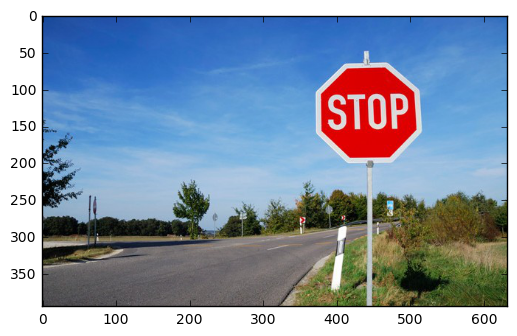

# Crowdsourcing Image Annotations - Part 4

## Retrieving bounding box image annotations from MTurk

In this tutorial, we are going to use Boto3, the AWS SDK for Python Version 3, to access the Amazon Mechanical Turk API. After installing the Boto SDK, we are going to use Boto3 for croudsourcing image annotations.

This fourth part shows how to retrieve our results and visualize them. This makes it easier to review the results to ensure they match our expectations. It is also a great way to review and approve the hard work and contributions by MTurk Worker customers who completed the HITs. 

We will build upon the Python tutorials that we have used so far. If you are new to this, please begin by following the steps in [Part 1](crowdsourcing_image_annotation_part1.md), [Part 2](crowdsourcing_image_annotation_part2.md), [Part 3](crowdsourcing_image_annotation_part3.md) of the tutorial. We will be building on concepts from these tutorials today, especially [Part 3](crowdsourcing_image_annotation_part3.md).

I have developed these tutorials by migrating previous Amazon tutorials for Boto2 and changing the code and steps as needed, specifically:

- [Tutorial: Getting started with MTurk and Python using Boto](https://blog.mturk.com/tutorial-getting-started-with-mturk-and-python-using-boto-452fb0243a30#.eggez6xwf)

- [Tutorial: Using the MTurk Requester Website together with Python and Boto](https://blog.mturk.com/tutorial-using-the-mturk-requester-website-together-with-python-and-boto-4a7ef0264b7e#.7uz9w4hov)

- [Tutorial: Annotating images with bounding boxes using Amazon Mechanical Turk](https://blog.mturk.com/tutorial-annotating-images-with-bounding-boxes-using-amazon-mechanical-turk-42ab71e5068a#.z0clf9aln)

- [Tutorial: Retrieving bounding box image annotations from MTurk](https://blog.mturk.com/tutorial-retrieving-bounding-box-image-annotations-from-mturk-253b86cb7502#.obytdqw01)

- [Tutorial: Measuring the accuracy of bounding box image annotations from MTurk](https://blog.mturk.com/tutorial-measuring-the-accuracy-of-bounding-box-image-annotations-from-mturk-ad3dfcdf8aa0#.m2fm7ad1q)

- [MTurk Code Samples Python](https://github.com/awslabs/mturk-code-samples/tree/master/Python)

## Retrieving the annotations

We will begin by picking up where we left off. Last time, we began by following the [Part 3 tutorial](crowdsourcing_image_annotation_part3.md), and learned how we can use MTurk to locate objects in images. We ended last week with the following code to retrieve our results:


```python
import boto3
import xmltodict
import ast

client = boto3.client(
    service_name='mturk',
    endpoint_url='https://mturk-requester-sandbox.us-east-1.amazonaws.com'
)

# This HIT id should be the HIT you just created - see the 6_boto3_bounding_box.py file for generating a HIT
hit_id = '3VW0145YLYC90ILLJGJ1WXKA7BHMJT'

hit = client.get_hit(HITId=hit_id)
print('Hit {} status: {}'.format(hit_id, hit['HIT']['HITStatus']))
response = client.list_assignments_for_hit(
    HITId=hit_id,
    AssignmentStatuses=['Submitted'],
    MaxResults=10
)

assignments = response['Assignments']
for assignment in assignments:
    workerId = assignment['WorkerId']
    assignmentId = assignment['AssignmentId']
    
    xml_doc = xmltodict.parse(assignment['Answer'])
    if type(xml_doc['QuestionFormAnswers']['Answer']) is list:
        # Multiple fields in HIT layout
        for answerField in xml_doc['QuestionFormAnswers']['Answer']:
            if answerField['QuestionIdentifier'] == 'annotation_data':
                workerAnswer = answerField['FreeText']
                print("The Worker with ID {} gave the answer {}".format(workerId, workerAnswer))
                # Convert workerAnswer to Dictionary
                workerAnswer = ast.literal_eval(workerAnswer)
                left = workerAnswer[0]['left']
                top  = workerAnswer[0]['top']
                print("The top and left coordinates are {} and {}".format(top, left))
```

    Hit 3VW0145YLYC90ILLJGJ1WXKA7BHMJT status: Reviewable
    The Worker with ID AYS6BR0KW5Z35 gave the answer [{"left":354,"top":31,"width":182,"height":191,"label":"stop sign 2"}]
    The top and left coordinates are 31 and 354


## Visualizing the results

Having the coordinates on-hand is helpful — after all, this is what we’ll use to train our algorithms. But as humans, it’s difficult for us to understand how good a job the MTurk Worker customer did without seeing the results in action.

To that end, we’re going to use [a 2D Python plotting library called Matplotlib](http://matplotlib.org/) to visualize these results. Matplotlib is a powerful library used for generating charts, graphs, histograms, and more. Today we’re only going to scratch the surface of what it can do.

To begin, we’ll add a few more lines to our imports at the top:


```python
import boto3
import xmltodict
import ast
# New imports
import numpy as np
import matplotlib.pyplot as plt
import matplotlib.patches as patches
import requests
from io import BytesIO
from PIL import Image

print(42896+63128+84420)

```

    190444
    20064


Next, we’ll load the image in Python that we asked Workers to annotate. The following code will take care of that:


```python
# Load the image from the HIT
response = requests.get('http://turk.s3.amazonaws.com/stop_sign_picture.jpg')
img = Image.open(BytesIO(response.content))
im = np.array(img, dtype=np.uint8)
# Create figure, axes, and display the image
fig,ax = plt.subplots(1)
ax.imshow(im)
```


    <matplotlib.image.AxesImage at 0x10d6037b8>


This loads the image into memory from a URL, and sets up the structures needed to show the image to the developer executing the Python code.

Next, we’ll process each of the bounding box annotations and create rectangles to overlay them onto the image. The following code will take care of that:


```python
import boto3
import xmltodict
import ast
import numpy as np
import matplotlib.pyplot as plt
import matplotlib.patches as patches
import requests
from io import BytesIO
from PIL import Image

client = boto3.client(
    service_name='mturk',
    endpoint_url='https://mturk-requester-sandbox.us-east-1.amazonaws.com'
)

# This HIT id should be the HIT you just created - see the 6_boto3_bounding_box.py file for generating a HIT
hit_id = '3VW0145YLYC90ILLJGJ1WXKA7BHMJT'

hit = client.get_hit(HITId=hit_id)
print('Hit {} status: {}'.format(hit_id, hit['HIT']['HITStatus']))
response = client.list_assignments_for_hit(
    HITId=hit_id,
    AssignmentStatuses=['Submitted'],
    MaxResults=10
)

assignments = response['Assignments']
for assignment in assignments:
    workerId = assignment['WorkerId']
    assignmentId = assignment['AssignmentId']
    
    xml_doc = xmltodict.parse(assignment['Answer'])
    if type(xml_doc['QuestionFormAnswers']['Answer']) is list:
        # Multiple fields in HIT layout
        for answerField in xml_doc['QuestionFormAnswers']['Answer']:
            if answerField['QuestionIdentifier'] == 'annotation_data':
                workerAnswer = answerField['FreeText']
                # Convert workerAnswer to Dictionary
                workerAnswer = ast.literal_eval(workerAnswer)

# Take one answer only
# Load the image from the HIT
response = requests.get('http://turk.s3.amazonaws.com/stop_sign_picture.jpg')
img = Image.open(BytesIO(response.content))
im = np.array(img, dtype=np.uint8)

# Create figure, axes, and display the image
fig,ax = plt.subplots(1)
ax.imshow(im)

# Draw the bounding box
for answer in workerAnswer:
    rect = patches.Rectangle((answer['left'],answer['top']),answer['width'],answer['height'],linewidth=1,edgecolor='#32cd32',facecolor='none')
    ax.add_patch(rect)
# Show the bounding box
plt.show()
```

    Hit 3VW0145YLYC90ILLJGJ1WXKA7BHMJT status: Reviewable





## Next steps

In this case, the Worker correctly found only one stop sign, annotated it, and it is shown in the lime green box overlaid on the image. If there were multiple stop signs, the code would have worked to show those, too.

Armed with this visualization, it is now easy to identify the quality of the result and approve the Worker’s submission. For a refresher on how to approve and dispose of HITs with Python, please see [Part 1 of this tutorial](crowdsourcing_image_annotation_part1.md).
