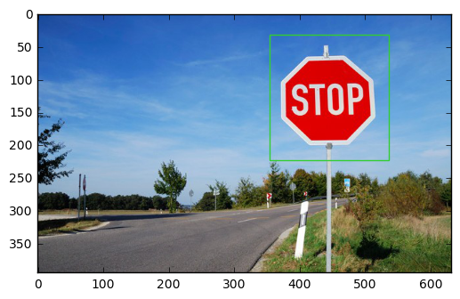
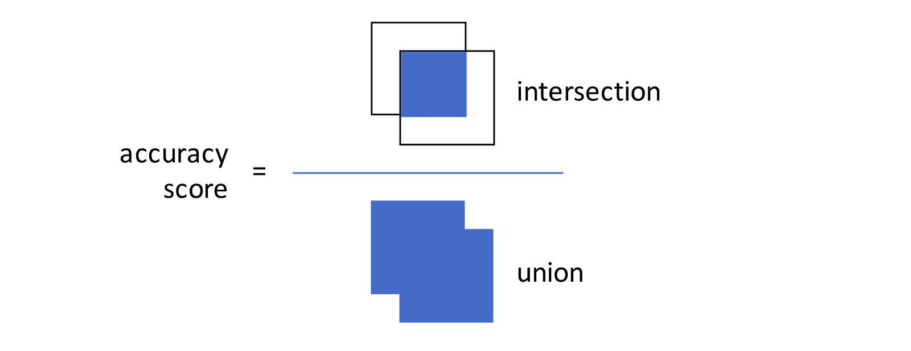
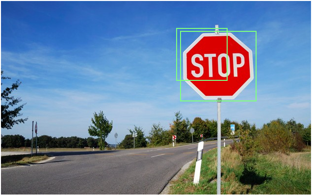

# Crowdsourcing Image Annotations - Part 5

## Measuring the accuracy of bounding box image annotations from MTurk

In this tutorial, we are going to use Boto3, the AWS SDK for Python Version 3, to access the Amazon Mechanical Turk API. After installing the Boto SDK, we are going to use Boto3 for croudsourcing image annotations.

In the [third part of this tutorial](crowdsourcing_image_annotation_part3.md), we showed how to use Amazon Mechanical Turk (MTurk) to annotate images with bounding boxes. This can be useful for Data Scientists and Machine Learning users who are trying to build ground truth training data to power their algorithms. In [Part 4](crowdsourcing_image_annotation_part4.md), we showed how to retrieve and visualize these bounding box annotations to help manually review submissions from Worker customers.

In this part, we will take things a step further and show how to calculate and score Worker submissions to help us programmatically evaluate accuracy. This is useful in several ways. For instance, you might annotate some of the images with bounding boxes yourself, and include those as “known answers” in the Human Intelligence Tasks (HITs) that you ask Workers to complete. In other words, you will ask Workers to complete some HITs where you already know the answer. You’ll compare your answer to that of the Worker on the assumption that a Worker who performs well on those HITs (where you can compare the answer) is more likely to perform well on other similar HITs (where you may not know the answer). If you’d prefer to not annotate images yourself, you might instead ask multiple Workers to annotate the same image (often referred to as “plurality”) and compare the agreement between Workers (often referred to as “inter-annotator agreement”). If the agreement levels are high, this would suggest the results are more reliable than if there was wide disagreement among Workers. Either strategy can be effective, it simply depends on your situation’s specific needs.

I have developed these tutorials by migrating previous Amazon tutorials for Boto2 and changing the code and steps as needed, specifically:

- [Tutorial: Getting started with MTurk and Python using Boto](https://blog.mturk.com/tutorial-getting-started-with-mturk-and-python-using-boto-452fb0243a30#.eggez6xwf)

- [Tutorial: Using the MTurk Requester Website together with Python and Boto](https://blog.mturk.com/tutorial-using-the-mturk-requester-website-together-with-python-and-boto-4a7ef0264b7e#.7uz9w4hov)

- [Tutorial: Annotating images with bounding boxes using Amazon Mechanical Turk](https://blog.mturk.com/tutorial-annotating-images-with-bounding-boxes-using-amazon-mechanical-turk-42ab71e5068a#.z0clf9aln)

- [Tutorial: Retrieving bounding box image annotations from MTurk](https://blog.mturk.com/tutorial-retrieving-bounding-box-image-annotations-from-mturk-253b86cb7502#.obytdqw01)

- [Tutorial: Measuring the accuracy of bounding box image annotations from MTurk](https://blog.mturk.com/tutorial-measuring-the-accuracy-of-bounding-box-image-annotations-from-mturk-ad3dfcdf8aa0#.m2fm7ad1q)

- [MTurk Code Samples Python](https://github.com/awslabs/mturk-code-samples/tree/master/Python)

## Picking up where we left off

In last week’s tutorial, we showed how to take a result from a Worker in the form of bounding box coordinates on an image and visualize them by overlaying them directly on the image. This meant taking a result like this:

`The Worker with ID A39ECJ12CY7TE9 gave the answer [{'left': 369, 'top': 47, 'width': 151, 'height': 160, 'label': 'stop sign'}]`

And visualize it in a form like this:



If this is new or unfamiliar to you, feel free to step through [part 4 of the tutorial](crowdsourcing_image_annotation_part4.md) to get caught up.

In this part, we’re going to show how to take multiple bounding box coordinates and compare them mathematically. This means taking answers such as the following:

`a = { 'width': 156, 'top': 61, 'height': 142, 'left': 363 }
b = { 'width': 109, 'top': 53, 'height': 124, 'left': 343 }`

and assigning a single score to them to help us gauge accuracy.

## Describing the approach

The approach we will use is commonly referred to as the “Intersection over Union” measure. The measure works by calculating the overlapping areas of intersection between two bounding boxes, divided by the total area of both bounding boxes. This produces an “accuracy score” that can be used to measure how close two bounding boxes match. The following can help visualize the approach:



When the accuracy score is 1.0, it represents an exact match. In practice, an accuracy score below 0.5 is probably an incorrect match. You may find that for your particular use case, you need to set different thresholds to achieve your desired accuracy.

## Demonstrating the approach in code

Using Python, we can code the approach above. Below is an example of the method we will call to calculate the Intersection over Union (IOU) accuracy score:


```python
def intersection_over_union(box_a, box_b):
    # Determine the coordinates of each of the two boxes
    xA = max(box_a['left'], box_b['left'])
    yA = max(box_a['top'], box_b['top'])
    xB = min(box_a['left']+box_a['width'], box_b['left']+box_b['width'])
    yB = min(box_a['top']+box_a['height'], box_b['top']+box_b['height'])
    
    # Calculate the area of the intersection area
    area_of_intersection = (xB - xA + 1) * (yB - yA + 1)
 
    # Calculate the area of both rectangles
    box_a_area = (box_a['width'] + 1) * (box_a['height'] + 1)
    box_b_area = (box_b['width'] + 1) * (box_b['height'] + 1)
    # Calculate the area of intersection divided by the area of union
    # Area of union = sum both areas less the area of intersection
    iou = area_of_intersection / float(box_a_area + box_b_area - area_of_intersection)
 
    # Return the score
    return iou
```

Let’s see how this works in practice. Here are some examples of the IOU score used on the same image from our last tutorial:


<center>IOU score = 0.83. This seems to be a good answer.</center>


<center>IOU score = 0.41. This does not seem like a good answer.</center>


<center>IOU score = 0.39. In this answer, the Worker thought we wanted the sign including the post. Our HIT was missing instructions that led to this confusion. While the IOU score suggests it’s an incorrect response, we can see the Worker was, in fact, correct under different assumptions. This is an important reminder to ensure your HIT instructions are clear.</center>

## Putting this approach into practice

There are may ways we can use this approach. One of our favorites, especially with image tasks, is to manually review or “spot check” those that fall below a given IOU threshold. This lets us spot cases like the one shown above where, in fact, it was our own instructions that were unclear (and no fault of the Worker customer who did an excellent job).
A popular approach is to use Bonuses to reward Workers who consistently deliver high-quality answers. Building on our Python code from previous bounding box tutorials, we could do the following:


```python
import boto3
import xmltodict
import ast
import numpy as np
import matplotlib.pyplot as plt
import matplotlib.patches as patches
import requests
from io import BytesIO
from PIL import Image

client = boto3.client(
    service_name='mturk',
    endpoint_url='https://mturk-requester-sandbox.us-east-1.amazonaws.com'
)

# This HIT id should be the HIT you just created - see the 6_boto3_bounding_box.py file for generating a HIT
hit_id = '3VW0145YLYC90ILLJGJ1WXKA7BHMJT'

hit = client.get_hit(HITId=hit_id)
print('Hit {} status: {}'.format(hit_id, hit['HIT']['HITStatus']))
response = client.list_assignments_for_hit(
    HITId=hit_id,
    AssignmentStatuses=['Submitted'],
    MaxResults=10
)

assignments = response['Assignments']
for assignment in assignments:
    workerId = assignment['WorkerId']
    assignmentId = assignment['AssignmentId']
    
    xml_doc = xmltodict.parse(assignment['Answer'])
    if type(xml_doc['QuestionFormAnswers']['Answer']) is list:
        # Multiple fields in HIT layout
        for answerField in xml_doc['QuestionFormAnswers']['Answer']:
            if answerField['QuestionIdentifier'] == 'annotation_data':
                workerAnswer = answerField['FreeText']
                # Convert workerAnswer to Dictionary
                workerAnswer = ast.literal_eval(workerAnswer)

# Take one answer only
# Ground truth answer we will use to compare the Worker's result
known_answer = { "left": 367, "top": 63, "width": 152, "height": 140, "label": "stop sign" }

# Set a threshold of 0.60; Workers above this will get a bonus
iou_threshold_for_bonus = 0.60
# Example the Worker example
iou = intersection_over_union(known_answer, workerAnswer[0])

if (iou >= iou_threshold_for_bonus):
    print("Bonus Worker {} for IOU {}".format(workerId, iou))
    response = client.send_bonus(
        WorkerId = workerId,
        BonusAmount = '0.5',
        AssignmentId = assignmentId,
        Reason = 'You did a great job on the Bounding Box HITs.'
    )
    print(response)

```

    Hit 3VW0145YLYC90ILLJGJ1WXKA7BHMJT status: Reviewable
    Bonus Worker AYS6BR0KW5Z35 for IOU 0.6139856557377049
    {'ResponseMetadata': {'HTTPHeaders': {'content-length': '2', 'date': 'Sun, 23 Jul 2017 17:39:45 GMT', 'x-amzn-requestid': 'eaba5bb9-6fcd-11e7-829e-99266917813b', 'content-type': 'application/x-amz-json-1.1'}, 'HTTPStatusCode': 200, 'RequestId': 'eaba5bb9-6fcd-11e7-829e-99266917813b', 'RetryAttempts': 0}}


The code above builds off of the [third part of this tutorial](crowdsourcing_image_annotation_part3.md). Please pay special attention to the first line that is needed to import the Price object used by grant_bonus to pay the Worker a bonus.

This code takes our Known Answer (the one we labeled manually) and uses it to compare the submission from the Worker. Where the submission exceeds an IOU accuracy score of 0.8, we provide the Worker with a bonus.

## Wrapping up

That’s it. Today, we showed how to compute a score to compare two bounding box image annotators, and use that score to pay a Worker a bonus if they meet or exceed a certain performance threshold.

This type of HIT and approach should be useful to many Requesters, but we expect it will be especially valuable to Data Scientists and Computer Vision experts looking to annotate images for use in Machine Learning models.

